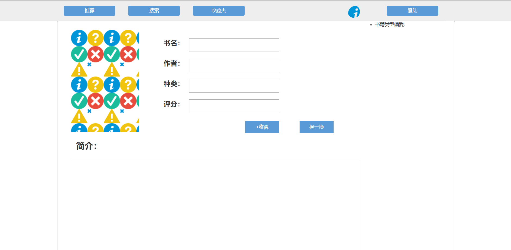
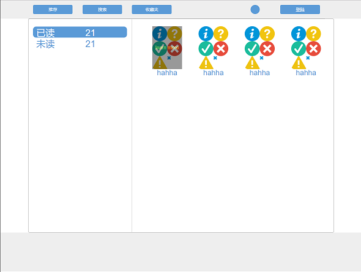
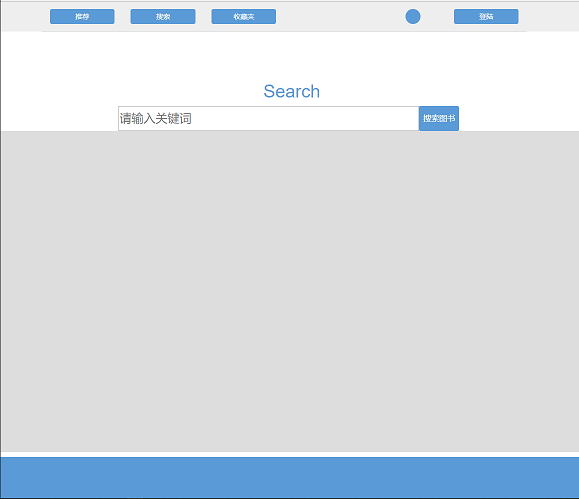
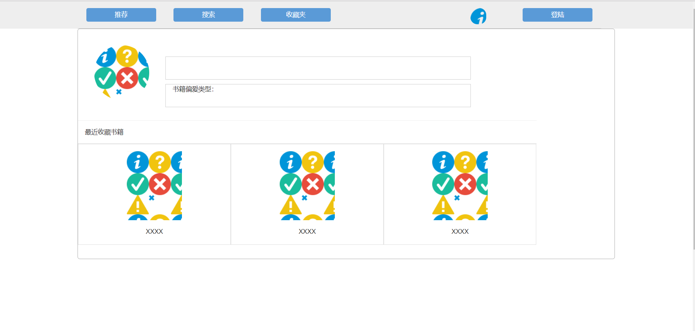

书籍推荐收藏

项目成员
* 郑 柳 2016210405063
组长
* 王胤凯 2016210405045
* 陈铭璇 2016210405062

项目描述
>    实现一个书籍推荐系统PC端，根据个人收藏的书籍类别喜好，推荐相同类别的书籍。 
>    也可以根据自己的喜好，查找书籍，同时支持根据类型进行查找书籍。 
>    在书籍详情界面可以进行收藏，以及了解书籍的简介。 
>    书友圈畅聊，分享自己对书籍的各种感受，从而有找到知音的意外之喜哦~

界面设计

1. 登陆注册界面 

2. 推荐界面 

3. 个人收藏界面 

4. 搜索界面 

5. 个人中心 

5. 书友圈界面 

数据结构

* userTable

| user_id  | name    | password | favourite_type |                  image.addr             | 
| :------: | :-----: | :------: | :------------: | :-------------------------------------: |
| 1        | abc     |    123   |    math        | http://106.14.151.175/user-image/xx.jpg |
| 2        | def     |    456   |    computer    |                                         |
*注：新注册用户favorite_type为null。
* bookTable

| book_id   | title              | author           |cover_addr                                | type     |   grade    | intro                                                                          |
|:---------:| :-----------------:| :--------------: |:---------------------------------------: | :-------:| :--------: | :-----------------------------------------------------------------------------: |
| 1         | HTml5与css3基础教程 | Elizabeth Castro | http://106.14.151.175/cover-image/xx.jpg | computer | 9.0        | 讲解html和css入门知识的经典畅销书，全面系统的讲解html5和css的基础知识以及实际运用技术 |
* usercollectTable

| user_id | name | book_id |
| :-----: | :--: | :-----: |
| 1       | abc  | 1       |
| 1       | def  | 2       |

功能模块
>    1. 登录注册功能 
>    根据用户在注册界面的输入，添加数据到后端数据库userTable中。同时请用户填写喜欢书籍的类型。
>    登录时，判断输入是否和userTable中的数据匹配，如果匹配登录，刷新页面；
>    反之，提示“用户名或密码错误”。
>    2. 推荐书籍功能 
>    根据用户设定的喜欢书籍的类型（favorite_type），
>    每天推荐他有可能会喜欢并且未收藏的书籍，显示在推荐界面上。 
>    思路：先在userTable根据user_id得到此用户的favorite_type，
>    再在bookTable中根据type = favorite_type得到一本此类书籍的book_id，
>    且在userCollectTable中满足此书book_id不存在于此用户收藏的book_id中。
>    如果满足了，则推荐该书，在bookTable中由book_id得到该书各项属性，
>    显示在书籍推荐界面上；如果不满足，选下一个book_id，直到满足。
>    如果该类书都已收藏，则跳转到另一个页面，该页面提醒用户“该类书都已收藏，没有更多推荐了”。
>    3. 收藏书籍功能
>    每本书籍都有收藏按钮，
>    如果点击，表示该书被收藏，
>    如果再点击一下，表示该书被移除收藏。
>    相关的响应函数，鼠标点下，数据库userCollectTable增加一行数据，
>    鼠标再次点击，移除收藏，
>    数据库userCollectTable删除与book_id匹配的一行数据，
>    4. 搜索书籍功能 
>    根据输入，调用豆瓣的搜索API，根据关键字搜索相关的书籍，在界面上显示相关书籍的书名、作者、出版社、豆瓣评分以及简介，最多显示20条数据；
>    反之，显示“查无此书”。
>    5. 个人中心显示最近收藏的书籍 
>    从数据表usercollect选择该用户收藏的书籍
>    php返回一个json数组，我们可以得到数组的长度，也就是收藏的书籍数量。 
>    倒数三个数据就是用户最近收藏的三本书。
>    如果总书籍不满三本，就只输出该用户所有书籍，空着的div显示“还未收藏”；如果一本都没有，三个div都显示“未收藏”。
>    6. 书友圈功能 
>    提供书友互聊的空间，增强图书推荐收藏的趣味。

项目分工
>    1. 推荐界面、个人中心、提示界面：郑柳
>    2. 收藏界面、搜索界面：王胤凯
>    3. 登录注册界面、书友圈界面：陈铭璇  
>    每个人完成响应界面，以及对应的后端，相关算法和响应函数
